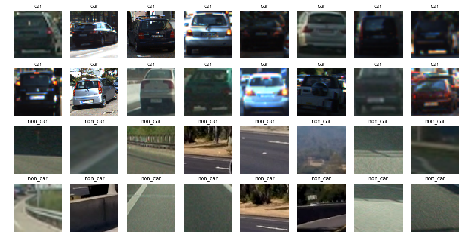
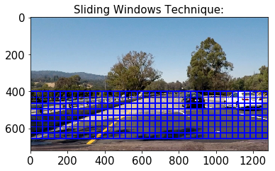
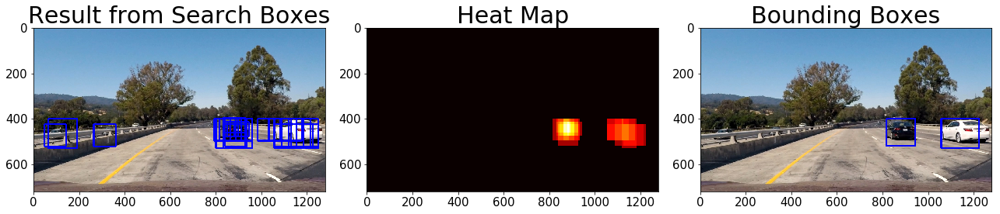

Vehicle Detection
---

The goals / steps of this project are the following:

* Perform a Histogram of Oriented Gradients (HOG) feature extraction on a labeled training set of images and train a classifier Linear SVM classifier
* Optionally, you can also apply a color transform and append binned color features, as well as histograms of color, to your HOG feature vector. 
* Note: for those first two steps don't forget to normalize your features and randomize a selection for training and testing.
* Implement a sliding-window technique and use your trained classifier to search for vehicles in images.
* Run your pipeline on a video stream (start with the test_video.mp4 and later implement on full project_video.mp4) and create a heat map of recurring detections frame by frame to reject outliers and follow detected vehicles.
* Estimate a bounding box for vehicles detected.

Datasets
---
Links to the labeled data for [vehicle](https://s3.amazonaws.com/udacity-sdc/Vehicle_Tracking/vehicles.zip) and [non-vehicle](https://s3.amazonaws.com/udacity-sdc/Vehicle_Tracking/non-vehicles.zip) examples to train classifier.

Steps
---
Algorithm for Vehicle detection and tracking consists of below steps:
- Load car and non car images
- Extract features based on color, HOG from images.
- Use SVM to train model to classify images in car and non car.
- Use sliding window to search potential matches for car images.
- Generate heat map from window search, also maintain history of heat map to remove false positives and flickering of boxes.

Data exploration
---
total number of car images is 8792 and non car images is 8968. Since dataset is balanced I didn't use any data augmentation techniques. Below is sample car and non car images from dataset

 HOG feature
 ---
 Histogram of Oriented Gradient is extracted from each input image and fed to SVM classifier to detect image contains car or not. Below is HOG feature computed for one of the car image from dataset
 

Sliding window search
---
Slide_window function generates list of windows to search for car in an input image. List of windows is controlled by y_top, y_bottom, window dimensions and overlap between windows.
Below image shows all possible windows for an given input image

For list of all windows, hog features and color feature are extracted. They are fed into SVM classifier which classified whether window contains car or not. Heat map is generated for each window where car is detected and history of heat map is maintained to remove false negatives and robost windows.
Below image shows windows where classifier classifies it as car, heap map for corresponding windows and bounding box generated from heat map.

Discussion:
Though algorithm implemented detect cars correctly in the images and in the video, it cannot be used in real time. One of the optimization that can easily be implemented is instead of finding bounding boxes for each frame in video, frames can be sampled at 5 frames/sec and algorithm can be applied to it since video captured is generally at 30FPS and objects doesn't change that often.
Car in opposite lanes are also detected in some of the video frame. To avoid detecting cars from opposite lane, sliding window search can be restricted in x-direction as well. Well, doing so algorithm will delay in detecting cars in same lane direction at sharp turns.

